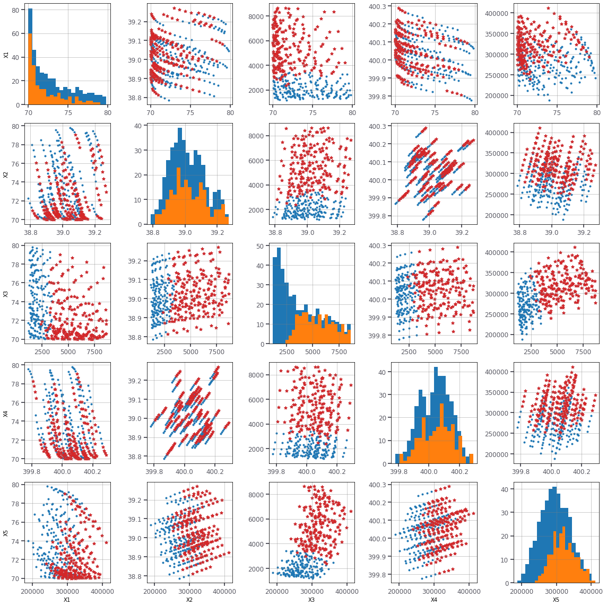

# Line-Sampling


This code is a port of the MATLAB LineSampling class from the OpenCossan generalised uncertainty quantification software. 

For more information about the software see the [OpenCossan] page.

The code requires at least Python 3.6. This version of the code is significantly simplified. If you want to use the code with a third party solver (e.g. high-fidelity model) then you may wish to download OpenCossan, which is freely available after registration. The MATLAB version of the code contains many optimisations to improve the performance of the code.

If you find this code useful for your research and decide to use it in a paper please cite the following paper:

de Angelis, Marco, Edoardo Patelli, and Michael Beer. "Advanced line sampling for efficient robust reliability analysis." Structural safety 52 (2015): 170-182. DOI: [10.1016/j.strusafe.2014.10.002]

``` bibtex
@article{deangelis2015,
  title={Advanced line sampling for efficient robust reliability analysis},
  author={de Angelis, Marco and Patelli, Edoardo and Beer, Michael},
  journal={Structural safety},
  volume={52},
  pages={170--182},
  year={2015},
  publisher={Elsevier}
}
```


[OpenCossan]:http://www.cossan.co.uk
[10.1016/j.strusafe.2014.10.002]:https://doi.org/10.1016/j.strusafe.2014.10.002

# Black-box reliability challenge problems

[RP8]   - Linear performance function with six lognormal variables.

[RP14]  - Non-linear performance function with five random variables. 

[RP22]  - Quadratic function with mixed term, convex.

[RP24]  - Non-linear performance with two normal random variables.


[RP8]:https://github.com/marcodeangelis/Line-sampling/blob/master/reliability_TNO_RP8.md
[RP14]:https://github.com/marcodeangelis/Line-sampling/blob/master/reliability_TNO_RP14.md
[RP22]:https://github.com/marcodeangelis/Line-sampling/blob/master/reliability_TNO_RP22.md
[RP24]:https://github.com/marcodeangelis/Line-sampling/blob/master/reliability_TNO_RP24.md


## TNO example problem 14


```python
from sampling import linesampling as ls
from sampling import dists as dists
from reliability.tnochallenge import problem
```


```python
RP14 = problem('RP14') # Import problem data
C14 = RP14.inputs() # Copula function for the input distributions
print(RP14)
```

Name: RP14
Link: https://rprepo.readthedocs.io/en/latest/reliability_problems.html#sec-rp-14


```python
alpha = ls.initialiseAlpha(RP14,C14,gradient=True)
print(alpha)
```

    [-0.36487337,  0.03357331,  0.84283305,  0.07948445,  0.38607633]

```python
LS = ls.LineSampling(lines=50,alpha=alpha,linegrid=[0,1,2,3,4,5,6,7])
pF, b, dp, LSdata, LSdata2, cvar, PFLine = LS.failureProbability(C14,RP14,additional=2)
print('failure probability:  [%.2e, %.2e]'%(pF[0],pF[1]))
print('reliability index:    [%g, %g]'%(b[0],b[1]))
print('coeff. of variation:  %g'%cvar)
print('total number of runs: %i'%RP14.evaluations())
```

    failure probability:  [3.41e-04, 1.11e-03]
    reliability index:    [3.05884, 3.39638]
    coeff. of variation:  0.110849
    total number of runs: 166


```python
LS.plot(data=LSdata,code=1)
```



