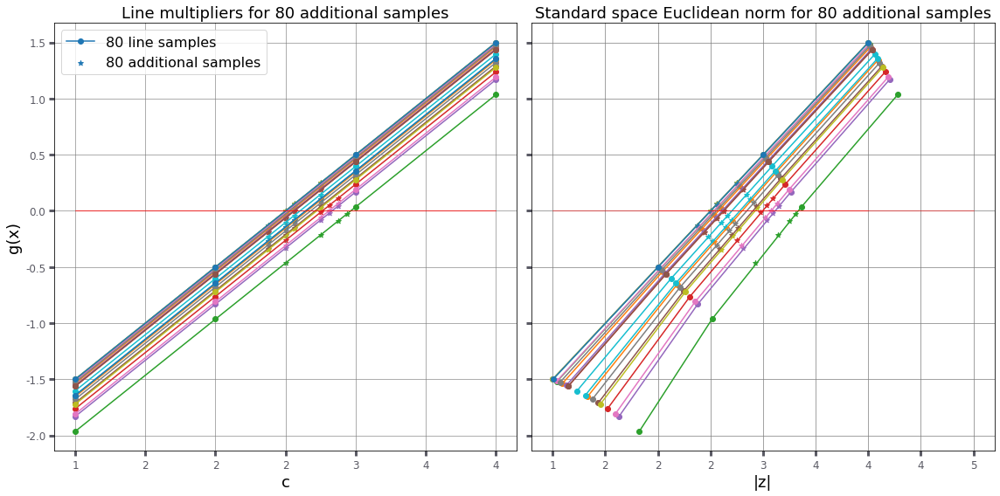
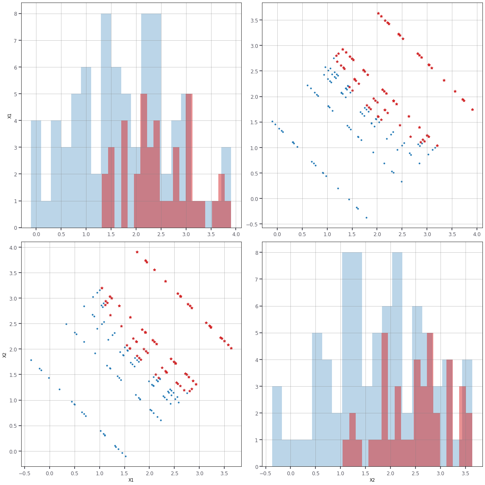
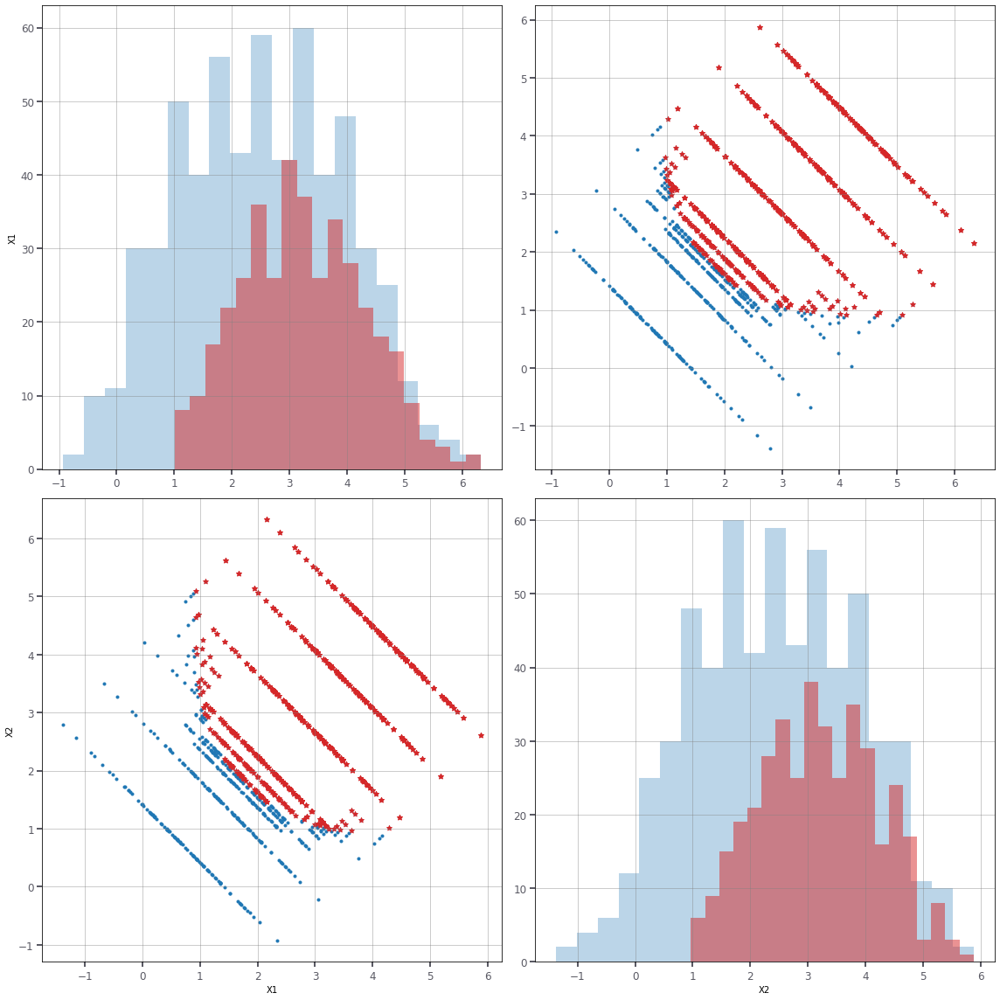

# RP22 problem statement

| `set_id` | `problem_id` |
| -------- | ------------ |
| -1        | 1            |

Tutorial set_1

## Overview

| Category                                              | Value          |
| ----------------------------------------------------- | ---------------|
| Type                                                  | Symbolic       |
| Number of random variables                            | 5              |
| Failure probability, $P_\mathrm{f}$                   | 4.16 1e-3      |
| Reliability index, $\beta=-\Phi^{-1}(P_\mathrm{f})$   | 2.64           |
| Number of performance functions                       | 1              |
| Reference                                             | [Grooteman2011]|

## Performance function

$$g({\bf X}) = 2.5 - (X_1 + X_2)/ \sqrt{2} + 0.1\ (X_1 - X_2)^2$$

## Random variables

The parametrization of distributions follows that of in.

| Variable  | Description | Distribution    | $\theta_1$    | $\theta_2$   | Mean     | Std     |
| --------- | ----------- | ----------------| ------------- | ------------ | -------- | --------| 
| $X_1$     | NA          |  Normal         | 0.0           | 1.0          | 0.0      | 1.0     |
| $X_2$     | NA          |  Normal         | 0.0           | 1.0          | 0.0      | 1.0     |

The random variables are mutually independent.

<hr>

[Grooteman2011] https://rprepo.readthedocs.io/en/latest/references.html#grooteman2011


```python
from sampling import linesampling as ls
from sampling import dists as dists
from reliability.tnochallenge import problem
```


```python
RP22 = problem('RP22')
RP22.info
```


    {'description': 'Tutorial set problem. Quadratic function with mixed term, convex.',
     'name': 'RP22',
     'kind': 'Tutorial set 1',
     'latexFormula': 'NA',
     'latexPF': 'NA',
     'targetBeta': 'NA',
     'Nv': 2,
     'Ng': 1,
     'Distributions': ['normal'],
     'Inputs': {'X[1]': {'dist': 'normal',
       't1': 0.0,
       't2': 1.0,
       'mean': 0.0,
       'std': 1.0},
      'X[2]': {'dist': 'normal', 't1': 0.0, 't2': 1.0, 'mean': 0.0, 'std': 1.0}},
     'index': 3,
     'reference': 'https://rprepo.readthedocs.io/en/latest/references.html#dai2016'}


```python
C22 = RP22.inputs() # Pi-copula (independent) function for the input distributions
C22.marginals() # notice the Gumbel-max distribution has rounded values in the table above
```


    (X1 ~ normal(t1=0, t2=1), X2 ~ normal(t1=0, t2=1))


```python
alpha = ls.initialiseAlpha(RP22,C22,gradient=True)
print(alpha)
```

    [0.7071067811865476, 0.7071067811865476]


```python
LS = ls.LineSampling(lines=20,alpha=alpha,linegrid=[1,2,3,4])
```


```python
cl,cr,data = LS.doLineZero(C22,RP22,additional=3)
print('Euclidean norm of design point: [%g, %g]'%(cl,cr))
```

    Euclidean norm of design point: [2.25, 2.625]


```python
RP22.evaluations()
```


    10


```python
pF, b, dp, LSdata, LSdata2, cvar, PFLine, lines = LS.failureProbability(C22,RP22,additional=4,seed=7)
print('failure probability:   [%.2e, %.2e]'%(pF[0],pF[1]))
print('reliability index:     [%g, %g]'%(b[0],b[1]))
print('coeff. of variation:   %g'%cvar)
print('total number of runs:  %i'%RP22.evaluations())
print('total number of lines: %i'%lines)
```

    failure probability:   [3.68e-03, 6.09e-03]
    reliability index:     [2.50678, 2.67968]
    coeff. of variation:   0.0866671
    total number of runs:  170
    total number of lines: 20


```python
dp
```


    (2.562598274716007, array([0.70088701, 0.71327231]))


```python
# There are no new candidate design points. So the analysis can stop
```

# Plotting the results


```python
LS.plotLines3([LSdata,LSdata2])
```





```python
LS.plot([LSdata,LSdata2], space='X')
```





```python
LS = ls.LineSampling(lines=100,alpha=alpha,linegrid=[1,2,3,4,5,6])
pF, b, dp, LSdata, LSdata2, cvar, PFLine, lines = LS.failureProbability(C22,RP22,additional=4,seed=7)
print('failure probability:   [%.2e, %.2e]'%(pF[0],pF[1]))
print('reliability index:     [%g, %g]'%(b[0],b[1]))
print('coeff. of variation:   %g'%cvar)
print('total number of runs:  %i'%RP22.evaluations())
print('total number of lines: %i'%lines)
```

    failure probability:   [3.46e-03, 5.74e-03]
    reliability index:     [2.52744, 2.70049]
    coeff. of variation:   0.0512113
    total number of runs:  1170
    total number of lines: 100


```python
LS.plot([LSdata,LSdata2], space='X')
```





```python

```
