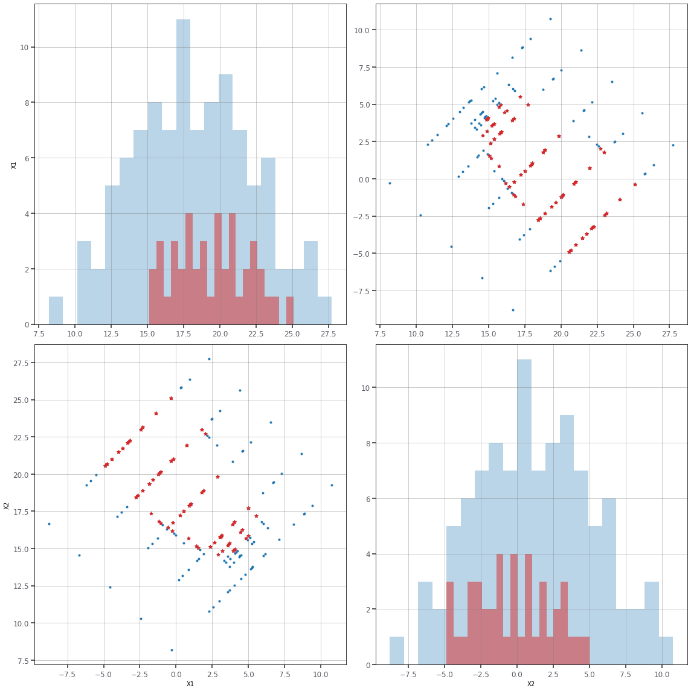
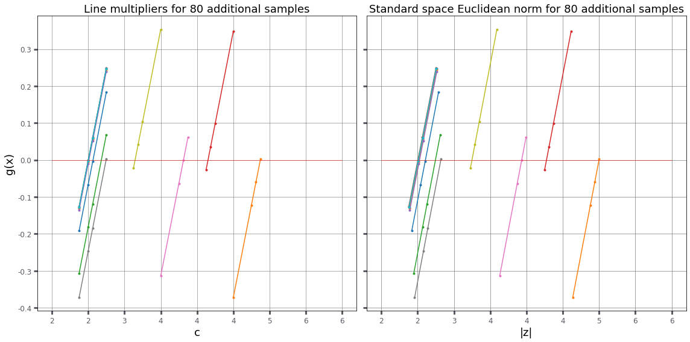
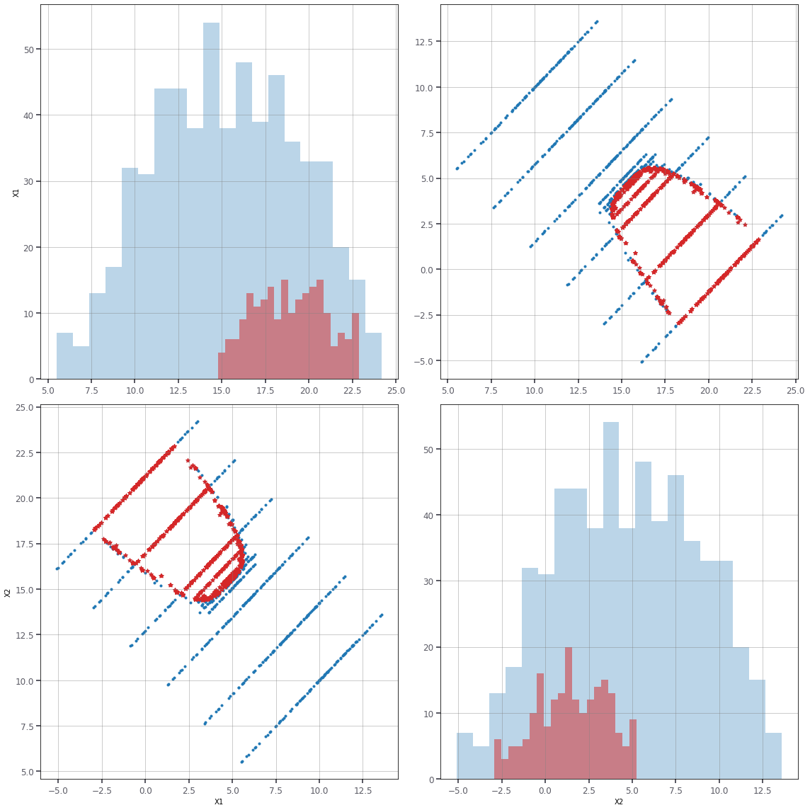
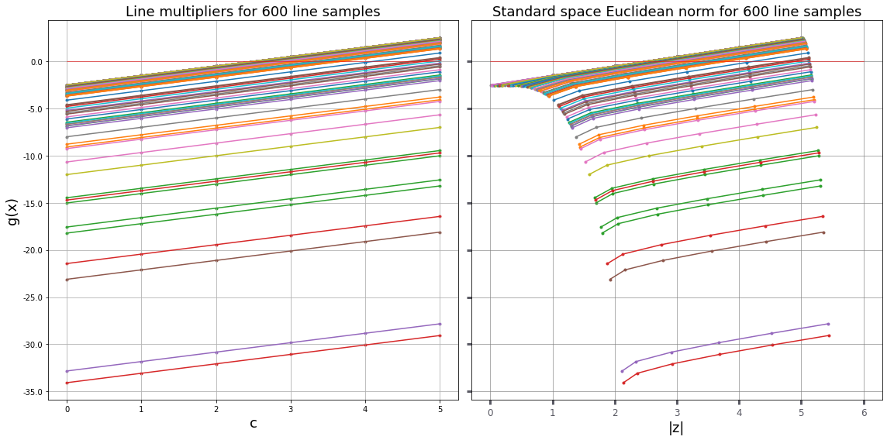

# RP24

| `set_id` | `problem_id` |
| -------- | ------------ |
| 1       | 2            |

challenge set_1

## Overview

| Category                                              | Value |
| ----------------------------------------------------- | ----- |
| Type                                                  | DACC  |
| Number of random variables                            | 2     |
| Failure probability, $P_\mathrm{f}$                   | DACC  |
| Reliability index, $\beta=-\Phi^{-1}(P_\mathrm{f})$   | DACC  |
| Number of performance functions                       | 1     |
| Continuity                                            | DACC  |
| Reference                                             | [Dai2016] |

## Performance function

DACC

## Random variables

The parametrization of distributions follows that of in
`sec:distributions`.

| Variable  | Description | Distribution    | $\theta_1$    | $\theta_2$   | Mean     | Std     |
| --------- | ----------- | ----------------| ------------- | ------------ | -------- | --------| 
| $X_1$     | NA          |  Normal         | 10.0          | 3.0          | 10.0     | 3.0    |
| $X_2$     | NA          |  Normal         | 10.0          | 3.0          | 10.0     | 3.0    |

The random variables are mutually independent.

## Visualization

DACC

## Implementation

DACC

<hr>

[RP24] https://rprepo.readthedocs.io/en/latest/reliability_problems.html#rp24

[Dai2016] https://rprepo.readthedocs.io/en/latest/references.html#dai2016 


```python
from sampling import linesampling as ls
from sampling import dists as dists
from reliability.tnochallenge import problem
```


```python
RP24 = problem('RP24')
RP24.info
```


    {'description': 'Non-linear performance of implicit type with two normal random variables.',
     'name': 'RP24',
     'kind': 'Challenge set 1',
     'latexFormula': 'NA',
     'latexPF': 'NA',
     'targetBeta': 'NA',
     'Nv': 2,
     'Ng': 1,
     'Distributions': ['normal'],
     'Inputs': {'X[1]': {'dist': 'normal',
       't1': 10.0,
       't2': 3.0,
       'mean': 10.0,
       'std': 3.0},
      'X[2]': {'dist': 'normal', 't1': 10.0, 't2': 3.0, 'mean': 10.0, 'std': 3.0}},
     'index': 3,
     'reference': 'https://rprepo.readthedocs.io/en/latest/references.html#dai2016'}


```python
C24 = RP24.inputs() # Copula function for the input distributions
C24.marginals() # notice the Gumbel-max distribution has rounded values in the table above
```


    (X1 ~ normal(t1=10, t2=3), X2 ~ normal(t1=10, t2=3))


```python
alpha = ls.initialiseAlpha(RP24,C24,gradient=True)
print(alpha)
```

    [0.7071064061528444, -0.7071071562200517]


```python
LS = ls.LineSampling(lines=20,alpha=alpha,linegrid=[2,3,4,5,6])
```


```python
cl,cr,data = LS.doLineZero(C24,RP24,additional=3)
print('Euclidean norm of design point: [%g, %g]'%(cl,cr))
```

    Euclidean norm of design point: [2.375, 2.75]


```python
RP24.evaluations()
```


    11


```python
pF, b, dp, LSdata, LSdata2, cvar, PFLine, lines = LS.failureProbability(C24,RP24,additional=4,seed=7)
print('failure probability:   [%.2e, %.2e]'%(pF[0],pF[1]))
print('reliability index:     [%g, %g]'%(b[0],b[1]))
print('coeff. of variation:   %g'%cvar)
print('total number of runs:  %i'%RP24.evaluations())
print('total number of lines: %i'%lines)
```

    Line 0 is entirely in the safe domain. This line will be discarded
    Line 3 is entirely in the safe domain. This line will be discarded
    Line 7 is entirely in the safe domain. This line will be discarded
    Line 8 is entirely in the safe domain. This line will be discarded
    Line 14 is entirely in the safe domain. This line will be discarded
    Line 15 is entirely in the safe domain. This line will be discarded
    Line 18 is entirely in the safe domain. This line will be discarded
    Line 19 is entirely in the safe domain. This line will be discarded
    failure probability:   [2.98e-03, 5.04e-03]
    reliability index:     [2.57331, 2.75048]
    coeff. of variation:   0.21963
    total number of runs:  159
    total number of lines: 12


```python
dp
```


    (2.565801785382751, array([ 0.74205755, -0.67033618]))


```python
# there might be a better important direction, but the analysis on line zero needs more definition
cl,cr,data = LS.doLineZero(C24,RP24,additional=10)
print('Euclidean norm of design point: [%g, %g]'%(cl,cr))
```

    Euclidean norm of design point: [2.49805, 2.50098]


```python
LS.plot([LSdata,LSdata2], space=['X'])
```





```python
LS.plotLines2(LSdata2)
```





```python
# Given that the upper bound of the norm of the design point (dp) is smaller than any other norm found on the limit state surface, we can't establish a new direction.
# We therefore run the analysis with more lines to decrease the CoV and possibly look for a better direction.
LS = ls.LineSampling(lines=100,alpha=alpha,linegrid=[0,1,2,3,4,5])
pF, b, dp, LSdata, LSdata2, cvar, PFLine, lines = LS.failureProbability(C24,RP24,additional=20)
print('failure probability:   [%.2e, %.2e]'%(pF[0],pF[1]))
print('reliability index:     [%g, %g]'%(b[0],b[1]))
print('coeff. of variation:   %g'%cvar)
print('total number of runs:  %i'%RP24.evaluations())
print('total number of lines: %i'%lines)
```

    Line 3 is entirely in the safe domain. This line will be discarded
    Line 4 is entirely in the safe domain. This line will be discarded
    Line 5 is entirely in the safe domain. This line will be discarded
    Line 9 is entirely in the safe domain. This line will be discarded
    Line 10 is entirely in the safe domain. This line will be discarded
    Line 16 is entirely in the safe domain. This line will be discarded
    Line 19 is entirely in the safe domain. This line will be discarded
    Line 22 is entirely in the safe domain. This line will be discarded
    Line 26 is entirely in the safe domain. This line will be discarded
    Line 29 is entirely in the safe domain. This line will be discarded
    Line 33 is entirely in the safe domain. This line will be discarded
    Line 45 is entirely in the safe domain. This line will be discarded
    Line 46 is entirely in the safe domain. This line will be discarded
    Line 47 is entirely in the safe domain. This line will be discarded
    Line 49 is entirely in the safe domain. This line will be discarded
    Line 54 is entirely in the safe domain. This line will be discarded
    Line 55 is entirely in the safe domain. This line will be discarded
    Line 60 is entirely in the safe domain. This line will be discarded
    Line 63 is entirely in the safe domain. This line will be discarded
    Line 66 is entirely in the safe domain. This line will be discarded
    Line 72 is entirely in the safe domain. This line will be discarded
    Line 79 is entirely in the safe domain. This line will be discarded
    Line 97 is entirely in the safe domain. This line will be discarded
    Line 98 is entirely in the safe domain. This line will be discarded
    failure probability:   [3.79e-03, 3.79e-03]
    reliability index:     [2.67044, 2.67045]
    coeff. of variation:   0.0761469
    total number of runs:  2294
    total number of lines: 76


```python
dp
```


    (2.500036049024229, array([ 0.70903726, -0.70517102]))


```python
LS.plot([LSdata,LSdata2], space='X')
```





```python
LS.plotLines(LSdata)
```





```python
N = 10_000_000
x,z,u = C24.sample(N=N) # shape of x: (6, N), void produces N=100 samples  
g24 = RP24.g()(*x)
```


```python
i=0
for gi in g24:
    if gi>1:
        i+=1
print('%e'%(i/N))
```

    1.059000e-04


```python
sn = dists.normal(0,1,'z')
beta = -sn.ppf(i/N)
print('%g'%beta)
```

    3.70451


```python

```
