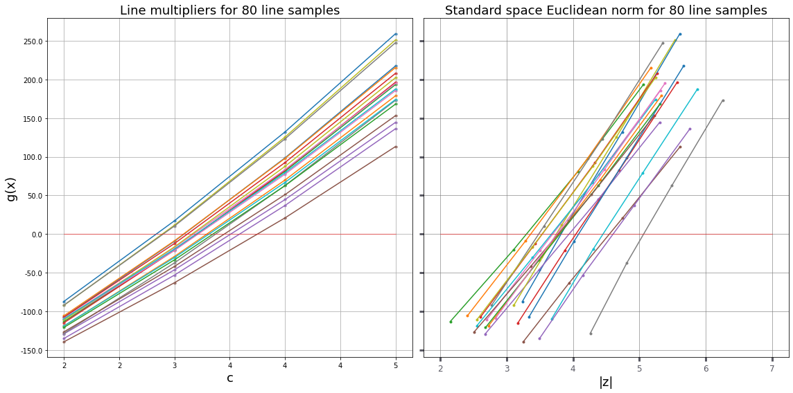
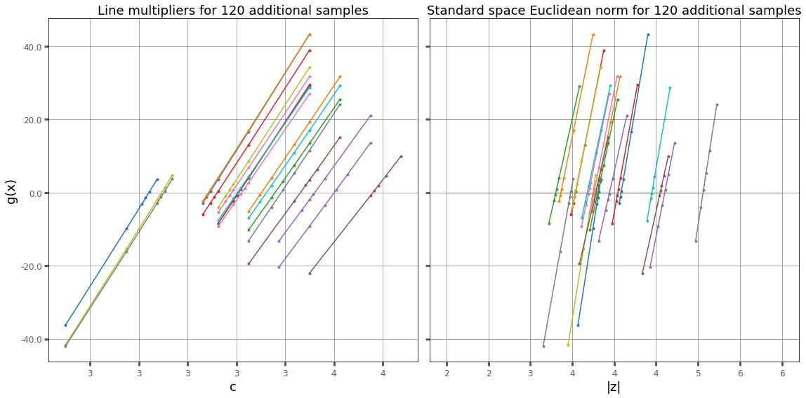
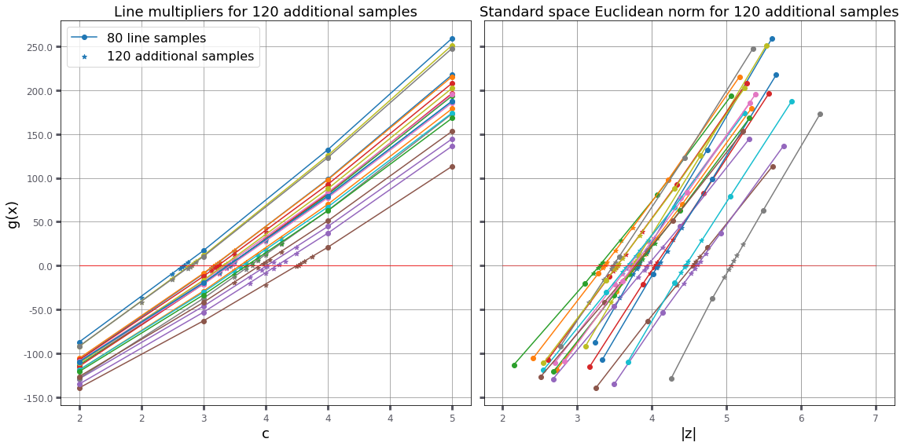
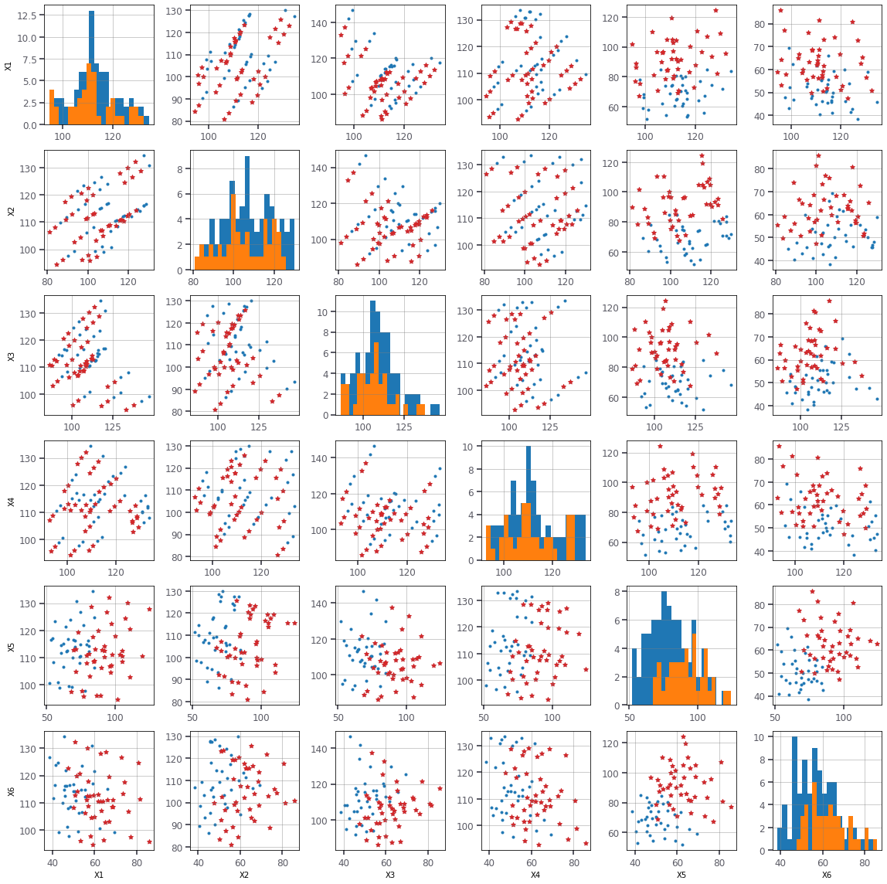
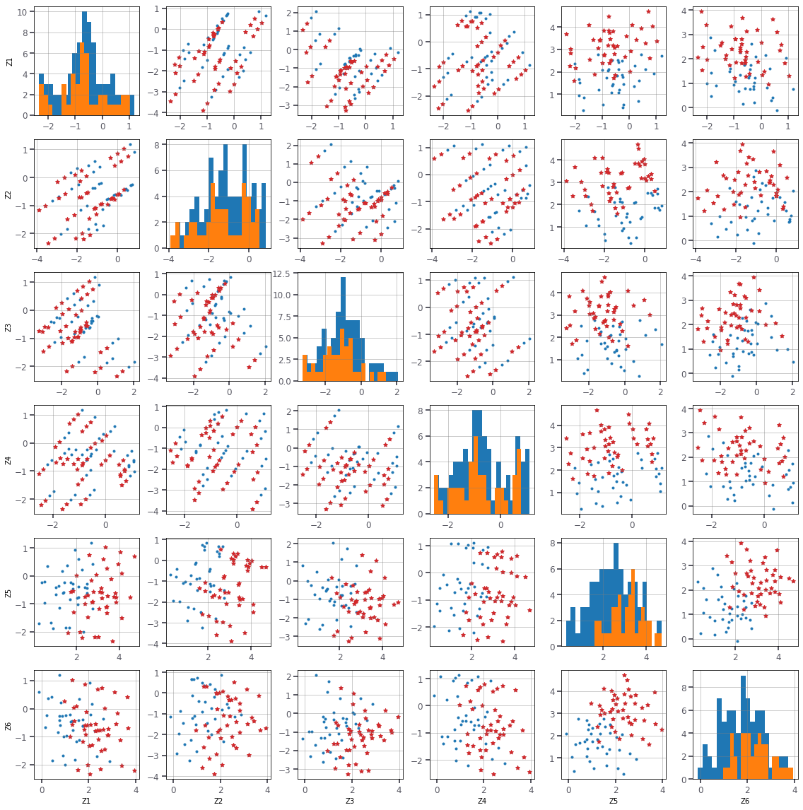

# RP8 reliability problem statement

| `set_id` | `problem_id` |
| -------- | ------------ |
| -1       | 1            |

challenge set_1

## Overview

| Category                                              | Value          |
| ----------------------------------------------------- | ---------------|
| Type                                                  | DACC           |
| Number of random variables                            | 6              |
| Failure probability, $P_\mathrm{f}$                   | 7.84e-4        |
| Reliability index, $\beta=-\Phi^{-1}(P_\mathrm{f})$   | 3.16           |
| Number of performance functions                       | 1              |
| Continuity                                            | $\geq C^1$     |
| Reference                                             | [Xu2018]       |

## Performance function

$$g({\bf X}) = X_1 + 2X_2 + 2X_3 + X_4 - 5X_5 - 5X_6$$

## Random variables

The parametrization of distributions follows that of in.

| Variable  | Description | Distribution    | \(\\theta_1\) | \(\\theta_2\)| Mean     | Std     |
| --------- | ----------- | ----------------| ------------- | ------------ | -------- | --------| 
| $X_1$     | NA          |  Lognormal      | 4.783         | 0.09975      | 120.0    | 12.0    |
| $X_2$     | NA          |  Lognormal      | 4.783         | 0.09975      | 120.0    | 12.0    |
| $X_3$     | NA          |  Lognormal      | 4.783         | 0.09975      | 120.0    | 12.0    |
| $X_4$     | NA          |  Lognormal      | 4.783         | 0.09975      | 120.0    | 12.0    |
| $X_5$     | NA          |  Lognormal      | 4.783         | 0.09975      | 50.0     | 10.0    |
| $X_6$     | NA          |  Lognormal      | 4.783         | 0.09975      | 40.0     | 8.0     |

The random variables are mutually independent.

<hr>

[Xu2018]: https://rprepo.readthedocs.io/en/latest/references.html#xu2018


```python
from sampling import linesampling as ls
from sampling import dists as dists
from reliability.tnochallenge import problem
```

## Instantiate the object with all the data identifying the model


```python
RP8 = problem('RP8')
print(RP8)
```

    Name: RP8
    Link: https://rprepo.readthedocs.io/en/latest/reliability_problems.html#sec-rp-8


```python
# The available information about the problem can be seen in one go with
RP8.info
```


    {'description': 'Tutorial set problem. Linear performance function with six lognormal variables.',
     'name': 'RP8',
     'kind': 'Tutorial set',
     'latexFormula': '$$g({\\bf X}) = X_1 + 2X_2 + 2X_3 + X_4 - 5X_5 - 5X_6$$',
     'latexPF': '$7.84\\ 10^{-4}$',
     'targetBeta': 3.16,
     'Nv': 6,
     'Ng': 1,
     'Distributions': ['lognormal'],
     'Inputs': {'X[1:4]': {'dist': 'lognormal', 'mean': 120, 'std': 12},
      'X[5]': {'dist': 'lognormal', 'mean': 50, 'std': 10},
      'X[6]': {'dist': 'lognormal', 'mean': 40, 'std': 8}},
     'index': 1}


```python
# We will be using two piece of information for the problem:
# 1. The (independent) copula function of the input random vairables
C8 = RP8.inputs() # Pi-copula of the problem
C8.marginals()
# returns 
# (X1 ~ Lognormal(t1=4.78252, t2=0.0997513),
#  X2 ~ Lognormal(t1=4.78252, t2=0.0997513),
#  X3 ~ Lognormal(t1=4.78252, t2=0.0997513),
#  X4 ~ Lognormal(t1=4.78252, t2=0.0997513),
#  X5 ~ Lognormal(t1=3.89241, t2=0.198042),
#  X6 ~ Lognormal(t1=3.66927, t2=0.198042))
```


```python
# A sample of the copula function can be obtained as follows:
x,z,u = C8.sample(N=1,seed=30) # shape of x: (6, N), void produces N=100 samples  
print(x) 
# prints:  
# [array([120.57857706]), array([125.37349755]), array([105.56579493]), array([125.6978498]), array([47.80327458]), array([38.43929189])]
# The copula can be used to perform transformation from the physical space X to the standard normal space Z
print(C8.map2std(x))
# returns:
# [array([-1.21348165]), array([1.96858688]), array([0.54451422]), array([-1.36668842]), array([1.30673409]), array([0.14566481])]
```


```python
# 2. The performance function of the problem:
g8 = RP8.g()
# the performance can be evaluated on a sample from the copula as follows:
g8(*x)
# returns:
# array([-233.33485107])
```


## Let's dive into the solution of the reliability problem

Line sampling requires an important direction to work. Let's compute it using the gradient in the standard normal space.


```python
# Let us create a new problem object to remove the previous evaluation from the total count of model's evaluations.
RP8 = problem('RP8')
```


```python
alpha = ls.initialiseAlpha(RP8,C8,gradient=True)
print(alpha)
```

    [-0.1637928660244218, -0.3275857320489999, -0.3275857320489999, -0.16379286602457807, 0.6679596573890065, 0.5343677259112521]


```python
LS = ls.LineSampling(lines=20,alpha=alpha,linegrid=[2,3,4,5])
```


# Perfom the analysis with line sampling


```python
pF, b, dp, LSdata, LSdata2, cvar, PFLine = LS.failureProbability(C8,RP8,additional=4,seed=7)
print('failure probability:  [%.2e, %.2e]'%(pF[0],pF[1]))
print('reliability index:    [%g, %g]'%(b[0],b[1]))
print('coeff. of variation:  %g'%cvar)
print('total number of runs: %i'%RP8.evaluations())
```

    failure probability:  [6.70e-04, 8.84e-04]
    reliability index:    [3.12664, 3.2073]
    coeff. of variation:  0.16861
    total number of runs: 327


## Verifying LS results

By doing the analysis on the line through the origin of the standard space, we can compute the Euclidean norm of the closest point to the origin.


```python
cl,cr,data = LS.doLineZero(C8,RP8,additional=9)
print('Euclidean norm of design point: [%g, %g]'%(cl,cr))
```

    Euclidean norm of design point: [3.27344, 3.2793]


```python
# This norm appears to be smaller than any other nors computed by the line sampling anlysis
# The smallest norm found on the line samples 
print('Smallest norm: %g'%dp[0])
```

    Smallest norm: 3.31325


```python
# which is greater than the upper bound of the Euclidean norm 
print('Smallest norm on lines %g > %g Euclidean norm of design point'%(dp[0],cr))
# So the analysis ends here, as no better important direction was found during the analysis. 
# Of course increasing the number of lines may increase the possibility to find a better direction.
```

    Smallest norm on lines 3.31325 > 3.2793 Euclidean norm of design point


# Let's plot the results


```python
LS.plotLines(LSdata,figsize=(16,8))
```





```python
LS.plotLines2(LSdata2,figsize=(16,8))
```





```python
LS.plotLines3([LSdata,LSdata2],figsize=(16,8))
```





```python
LS.plot([LSdata],space='X')
```





```python
LS.plot([LSdata],space='Z')
```





```python

```
